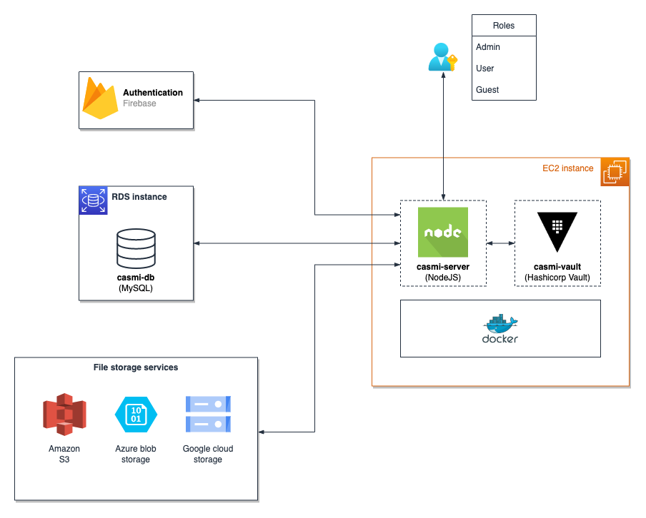

# CASMI

**Cloud Agnostic Storage Management Interface (CASMI)**

CASMI is a NodeJS solution that enables cloud-agnostic file management. The CASMI server provides access-controlled APIs to interact with file storage services of different cloud providers. It currently supports Amazon S3, Google Cloud Storage, and Azure Blob Storage.

[Usage instructions](https://github.com/rahuls98/CASMI/blob/main/usage-instructions.pdf)



<br/>

# Dependencies

-   Hashicorp vault server to maintain provider secrets, with a role (and associated policy) for casmi-server
-   Firebase authentication project for casmi-server with client and service account credentials, provided in a `firebase.config.js` file
-   MySQL database server (Setup script : [casmi.sql](https://github.com/rahuls98/CASMI/blob/main/casmi.sql))
-   `.env` file (Reference : [.env.example](https://github.com/rahuls98/CASMI/blob/main/.env.example))

<br/>

# Setup

### casmi-vault (Hashicorp Vault)

#### docker-compose.yml

```
version: "3.1"
services:
    casmi-vault:
        image: vault
        container_name: casmi-vault
        ports:
            - <host_port>:<container_port>
        volumes:
            - /path/to/volumes/logs:/vault/logs
            - /path/to/volumes/file:/vault/file
            - /path/to/volumes/config:/vault/config
        cap_add:
            - IPC_LOCK
        entrypoint: vault server -config=/vault/config/vault.json
```

#### vault.json

```
{
    "backend": {
        "file": {
            "path": "/vault/file"
        }
    },
    "listener": {
        "tcp": {
            "address": "0.0.0.0:<container_port>",
            "tls_disable": 1
        }
    },
    "ui": true
}
```

### casmi-auth (Firebase Authentication)

#### firebase.config.js

```
{
    FIREBASE: {
        CLIENT: {
            apiKey: "",
            authDomain: "",
            projectId: "",
            storageBucket: "",
            messagingSenderId: "",
            appId: "",
        },
        ADMIN: {
            type: "",
            project_id: "",
            private_key_id: "",
            private_key: "",
            client_email: "",
            client_id: "",
            auth_uri: "",
            token_uri: "",
            auth_provider_x509_cert_url: "",
            client_x509_cert_url: "",
        },
    },
}
```

### casmi-server

#### NodeJS

Developed and tested with - [v16.16.0](https://nodejs.org/dist/v16.16.0/docs/api/)

Steps:

1. Clone repository
2. Place dependent **.env** and **firebase.config.js** in the project root directory
3. Change directory to project root
4. Install node package dependencies using : `npm install`
5. Run node server : `npm start`

#### Docker

```
docker run -d \
-p 80:8000 \
-v /path/to/firebase.config.js:/app/firebase.config.js \
-v /path/to/uploads:/app/uploads \
--env-file /path/to/.env \
--name casmi-server \
sureshrahul/casmi:<tag>
```

#### docker-compose.yml

```
version: "3.1"
services:
    casmi-server:
        image: sureshrahul/casmi:<tag>
        container_name: casmi-server
        ports:
            - 80:8000
        volumes:
            - /path/to/firebase.config.js:/app/firebase.config.js
            - /path/to/.env:/app/.env
            - /path/to/uploads:/app/uploads
```
